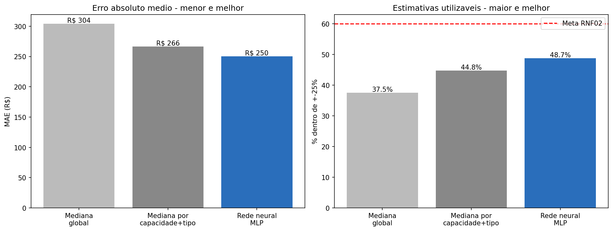
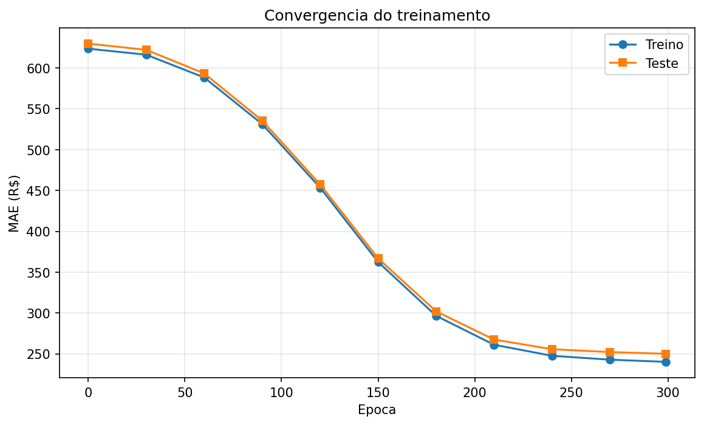

# Resultados dos experimentos

Execução em Google Colab, CPU, a partir do commit publicado no repositório.
Semente fixa em 42; todos os números são reprodutíveis.

## Preparação dos dados

| Etapa | Registros |
|---|---|
| Anúncios no Rio de Janeiro | 48.713 |
| Após filtro de Copacabana | 15.036 |
| Após limpeza e remoção de outliers | 13.558 |
| Treino / teste (80/20) | 10.846 / 2.712 |

Matriz final de atributos: 13.558 × 12.

## Configuração do treino

| Parâmetro | Valor |
|---|---|
| Arquitetura | 12 → 32 (ReLU) → 1 |
| Função de perda | `nn.L1Loss` (MAE) |
| Otimizador | Adam |
| Taxa de aprendizado | 0,01 |
| Épocas | 300 |
| Dispositivo | CPU |
| Tempo de treino | 7,5 s |

## Resultado principal

| Método | MAE (R$) | Dentro de ±25% |
|---|---|---|
| Mediana global | 304,21 | 37,5% |
| Mediana por capacidade e tipo | 266,42 | 44,8% |
| **Rede neural MLP** | **250,03** | **48,7%** |



## Convergência



Duas leituras importantes:

**Não há sobreajuste.** As curvas de treino e teste ficam praticamente coladas
ao longo de todo o treinamento — R$ 240 contra R$ 250 ao final, diferença de
4%. O modelo generaliza para dados que não viu.

**O treino foi interrompido antes da convergência.** As duas curvas ainda
apresentam inclinação negativa na época 300 (R$ 255 → R$ 252 → R$ 250 nas
últimas medições). O limite de 300 épocas foi restritivo; não é o limite do
modelo.

## Comparação de configurações

Nove combinações: três tamanhos de camada oculta por três taxas de aprendizado.

| Neurônios | Learning rate | MAE (R$) | Dentro de ±25% |
|---|---|---|---|
| 64 | 0,050 | 238,95 | 49,5% |
| 32 | 0,050 | 240,35 | 49,3% |
| 16 | 0,050 | 240,50 | 49,7% |
| 64 | 0,010 | 244,32 | 49,5% |
| 32 | 0,010 | 250,03 | 48,7% |
| 16 | 0,010 | 255,18 | 48,8% |
| 64 | 0,005 | 256,82 | 48,4% |
| 32 | 0,005 | 354,64 | 30,7% |
| 16 | 0,005 | 459,34 | 6,0% |

**O que estávamos tentando descobrir:** se o desempenho era limitado pela
capacidade da rede ou pela configuração do treino.

**Resposta:** pela configuração. A taxa de aprendizado explica quase toda a
variação, enquanto o número de neurônios é praticamente irrelevante — com
lr = 0,05, as três larguras ficam entre R$ 238,95 e R$ 240,50, diferença de
R$ 1,55.

O caso extremo confirma o diagnóstico da curva de convergência: 16 neurônios
com lr = 0,005 resulta em MAE de R$ 459 e apenas 6% de acertos. Não é uma
configuração ruim por natureza — é lenta demais para convergir em 300 épocas.

## Verificação dos requisitos

| Requisito | Critério | Resultado |
|---|---|---|
| RNF01 | MAE inferior ao melhor baseline (R$ 266,42) | **Atendido** — R$ 250,03 |
| RNF02 | Ao menos 60% das estimativas dentro de ±25% | **Não atendido** — 48,7% |
| RNF03 | Duas execuções com a mesma semente produzem métricas idênticas | Atendido |
| RNF04 | Inferência individual em menos de 1 s | Atendido |
| RNF05 | Treino completo em CPU em menos de 5 min | Atendido — 7,5 s |
| RNF07 | Índice de demanda determinístico e independente do modelo | Atendido — valores idênticos em duas máquinas distintas |

### Sobre o RNF02

Nenhuma das nove configurações testadas ultrapassou 49,7%, o que descarta a
hipótese de ajuste de hiperparâmetros. O limite está nos atributos disponíveis.

Os 12 atributos capturam essencialmente o **tamanho** do imóvel — quartos,
banheiros e capacidade são os três mais correlacionados com o preço (0,509,
0,472 e 0,431). Fatores que explicam boa parte da variação de preço em
Copacabana não estão na base: vista para o mar, andar, estado de conservação,
distância da praia e da quadra.

A meta de 60% foi arbitrada no início do projeto a partir dos 44,8% do
baseline, sem base empírica. O modelo entregou um ganho real de quase 4 pontos
percentuais, mas a meta era otimista para o conjunto de atributos disponível.

## Componente de sazonalidade

Datas com maior pressão de demanda, entre as 365 avaliadas:

| Data | IPD | Faixa | Evento |
|---|---|---|---|
| 31/12/2026 | 1,259 | crítica | Réveillon |
| 30/12/2026 | 1,250 | crítica | Réveillon |
| 01/01/2027 | 1,249 | crítica | Réveillon |
| 02/01/2027 | 1,221 | crítica | Réveillon |
| 29/12/2026 | 1,218 | crítica | Réveillon |
| 05/09/2026 | 1,215 | crítica | Rock in Rio |
| 06/09/2026 | 1,207 | crítica | Rock in Rio |
| 06/02/2027 | 1,190 | alta | Carnaval |
| 07/02/2027 | 1,189 | alta | Carnaval |

Distribuição das faixas: 327 datas normais, 16 elevadas, 15 altas e 7 críticas.

## Exemplo de saída do sistema

```
Imóvel: 4 hóspedes, 2 quartos, 1 banheiro
Preço-base estimado: R$ 409,40

Data consultada: 2026-12-31
Pressão de demanda: crítica (IPD 1.259)

>> Recomendação: considerar ajuste para cima. A decisão final é do gestor.
```

Os dois componentes operam de forma independente: a rede neural estima o
preço-base a partir dos atributos, o índice classifica a data, e a combinação
acontece apenas na apresentação ao usuário, que mantém a decisão final.

## Próximos passos

1. **Enriquecer os atributos.** Extrair sinais do campo `amenities` (vista para
   o mar, ar-condicionado, piscina) e derivar a distância até a praia a partir
   de latitude e longitude. É a via mais promissora para o RNF02.
2. **Treinar até a convergência.** A curva mostra que 300 épocas interromperam
   o aprendizado. Aumentar as épocas e adotar parada antecipada com base no
   erro de teste.
3. **Incorporar a dimensão temporal.** O modelo atual estima um preço-base a
   partir de uma fotografia de baixa temporada. Usar o calendário diário como
   base de treino permitiria prever o preço por data, em vez de sinalizar
   pressão.
